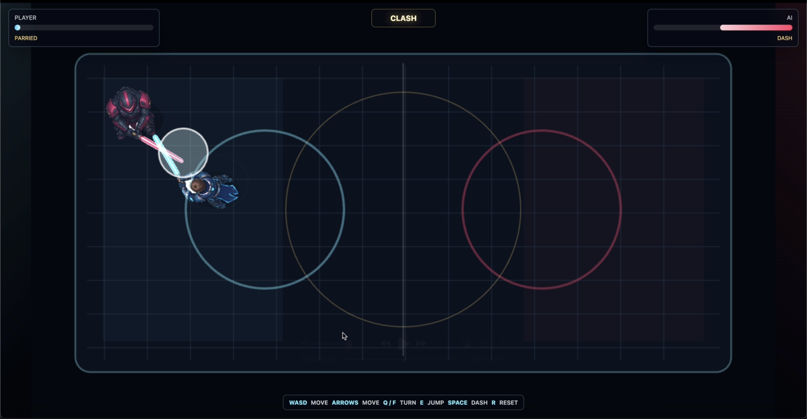

# Lightsaber Duel（ライトセイバー・デュエル）


ライトセイバーを構えたプレイヤーが、アリーナでAIファイターと1対1で戦うブラウザゲームです。移動、旋回、ジャンプ、ダッシュを組み合わせ、ライトセイバーを相手の身体へ接触させて勝利を目指します。

## デモ

[GitHub Pagesでプレイする](https://miya123123.github.io/lightsaber-duel/)

## ゲームの特徴

- **接触型のライトセイバー戦闘**: 攻撃ボタンを連打する方式ではなく、キャラクターの向きと位置を操作してセーバーを相手へ当てます。
- **トップダウン移動**: トップダウン視点で前後左右斜め方向に移動できます。
- **手動旋回**: プレイヤーやセーバーの向きを手動で調整できます。
- **ジャンプとダッシュ**: ジャンプで相手を飛び越え背後を奪ったり、ダッシュで一気に間合いを詰めたり離したりできます。
- **状況に応じて動くAI**: AIはプレイヤーへゆっくり向き直り、距離に応じて接近、回避、旋回、ジャンプ、ダッシュを使います。
- **セーバー同士の衝突**: セーバーがぶつかると、両者が反対方向へ弾かれます。

## 操作方法

| 操作 | キー | 内容 |
| --- | --- | --- |
| 移動 | `W` `A` `S` `D` または矢印キー | 上下左右・斜め方向へ移動 |
| 左旋回 | `Q` | プレイヤーとセーバーを反時計回りに旋回 |
| 右旋回 | `F` | プレイヤーとセーバーを時計回りに旋回 |
| ジャンプ | `E` | 向いている方向、または入力中の移動方向へ跳ぶ |
| ダッシュ | `Space` | 向いている方向、または入力中の移動方向へ高速移動 |
| リセット | `R` | 対戦を最初からやり直す |
| 再戦 | 勝敗決着後の「再戦」ボタン | 新しい対戦を開始 |

> 現在の操作はキーボード向けです。画面レイアウトはモバイル幅に対応していますが、タッチ操作UIは実装されていません。

## ルール

- 移動と旋回で、ライトセイバーの先を相手の身体へ当てます。
- 命中すると相手の体力が減り、ノックバックが発生します。
- AIの体力を先に`0`にするとプレイヤーの勝利です。
- ジャンプ中は双方の身体への攻撃判定とセーバー同士の衝突が無効になります。また、ジャンプとダッシュにはクールダウンがあり、同時には使用できません。

## 生成した画像アセット

生成・加工した画像は`public/assets/generated/`に保存しています。


## 起動方法

```bash
npm run dev
```

# 使用技術
- Codex（GPT-5.5・高）：開発とREADME作成に使用
- image_gen（GPT-Image2）：各種画像生成に使用
- Phaser 3 / TypeScript / Vite / Node.js：実装・ビルドに使用
- Playwright Interactive：テストに使用
- agent-sprite-forge（generate2dsprite）：ジャンプアニメーション画像の生成に使用
- OpenAI Docs：OpenAIの画像生成仕様の確認に使用

ターミナルに表示されたURLをブラウザで開いてください。既定のURLは`http://127.0.0.1:5173`です。

