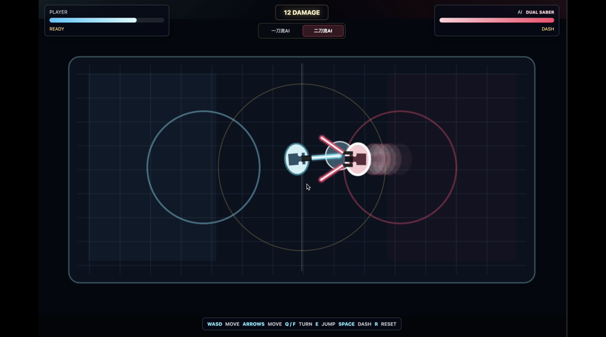

# Lightsaber Duel（ライトセイバー・デュエル）



ライトセイバーを構えたプレイヤーが、アリーナでAIファイターと1対1で戦うブラウザゲームです。移動、旋回、ジャンプ、ダッシュを組み合わせ、ライトセイバーを相手の身体へ接触させて勝利を目指します。

## デモ

[GitHub Pagesでプレイする](https://miya123123.github.io/lightsaber-duel/)

## ゲームの特徴

- **接触型のライトセイバー戦闘**: 攻撃ボタンを連打する方式ではなく、キャラクターの向きと位置を操作してセイバーを相手へ当てます。
- **一刀流・二刀流AI選択**: 対戦中に一刀流AIと二刀流AIを切り替えられます。切り替えると新しい対戦が始まります。
- **二刀流のダブルヒット**: 2本のセイバーが同時に命中すると、通常の2倍ダメージと2点のヒット演出が発生します。
- **中央突きへの迎撃**: 二刀流AIは自身の弱点である2本のセイバーの中央を狙う攻撃を検知すると、ダッシュとダブルヒットで迎撃します。
- **ジャンプとダッシュ**: ジャンプで相手を飛び越え背後を奪ったり、ダッシュで一気に間合いを詰めたり離したりできます。
- **状況対応型のルールAI**: AIは距離と向きに応じて接近、回避、旋回、ジャンプ、ダッシュを使い分けます。
- **セイバー同士の衝突**: セイバーがぶつかると、両者が反対方向へ弾かれます。
- **手続き描画**: アリーナ、ファイター、セイバー、ヒット演出はPhaser Graphicsで描画されます。

## 操作方法

| 操作 | キー | 内容 |
| --- | --- | --- |
| 移動 | `W` `A` `S` `D` または矢印キー | 上下左右・斜め方向へ移動 |
| 左旋回 | `Q` | プレイヤーとセイバーを反時計回りに旋回 |
| 右旋回 | `F` | プレイヤーとセイバーを時計回りに旋回 |
| ジャンプ | `E` | 向いている方向、または入力中の移動方向へ跳ぶ |
| ダッシュ | `Space` | 向いている方向、または入力中の移動方向へ高速移動 |
| AI切り替え | `一刀流AI` / `二刀流AI` ボタン | 対戦相手のロードアウトを切り替え |
| リセット | `R` | 対戦を最初からやり直す |
| 再戦 | 勝敗決着後の `再戦` ボタン | 同じAI構成で新しい対戦を開始 |

> 操作はキーボード向けです。画面レイアウトはモバイル幅に対応していますが、タッチ操作UIは実装していません。

## ルール

- ライトセイバーを相手の身体へ当てるとダメージとノックバックが発生します。
- 相手の体力を先に `0` にすると勝利です。
- ジャンプ中は身体への攻撃判定とセイバー同士の衝突が無効になります。
- ジャンプとダッシュにはクールダウンがあり、同時には使用できません。

## 起動方法

```bash
git clone --branch implementing-dual-wielding-enemy https://github.com/miya123123/lightsaber-duel.git
cd lightsaber-duel
npm install
npm run dev
```

ターミナルに表示されたURLをブラウザで開いてください。既定のURLは `http://127.0.0.1:5173` です。

## 使用技術

- Phaser 3
- TypeScript
- Vite
- Node.js / npm
- Playwright
- Codex
